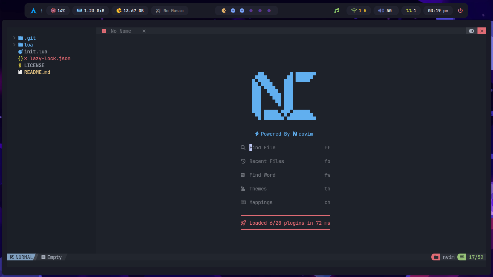

# ✨ My Neovim Setup

<div align="center">


</div>

<div align="center">
  
  <p><em>✨ Preview com tema escuro ✨</em></p>
</div>

## 🧰 Stack Tecnológica

### 🔧 Ferramentas Essenciais

Este setup oferece um ambiente de desenvolvimento robusto e modular, utilizando ferramentas modernas para produtividade, organização e performance.

<div align="center">


</div>

### 🧪 Linguagens Suportadas

Este ambiente oferece suporte completo a múltiplas linguagens, com realce de sintaxe, autocompletar, linting e formatação.

<div align="center">

| Ícone                                                                 | Servidor LSP                  | Descrição                       |
|-----------------------------------------------------------------------|-------------------------------|---------------------------------|
|  | `biome`                       | JavaScript/TypeScript formatter |
|                     | `css-lsp`                     | CSS intelligence                |
|                            | `gopls`                       | Go language server              |
|                   | `html-lsp`                    | HTML support                    |
|                         | `lua-language-server`         | Lua language server             |
|                 | `prisma-language-server`      | Prisma ORM support              |
|           | `prettier`                    | Code formatter                  |
|                 | `ruff-lsp`                    | Python linter                   |
|                      | `rust-analyzer`               | Rust language server            |
|   | `tailwindcss-language-server` | Tailwind CSS support            |
|     | `typescript-language-server`  | TypeScript support              |

</div>

## ⌨️ Atalhos do Codeium

<div align="center">

| Atalho           | Modo      | Ação                           |
|------------------|-----------|--------------------------------|
| `<M-Tab>`        | Insert    | Aceitar sugestão               |
| `<M-]>`          | Insert    | Próxima sugestão               |
| `<M-[>`          | Insert    | Sugestão anterior              |
| `<C-x>`          | Insert    | Limpar sugestão                |
| `<M-Bslash>`     | Insert    | Forçar completar               |
| `<D-l>`          | Insert    | Aceitar próxima palavra (Mac)  |

</div>

## 🚀 Instalação Rápida

```bash
git clone https://github.com/VictorzllDev/nvim && nvim
```

<p align="center"> Feito com ❤️ por <a href="https://github.com/VictorzllDev">Victor</a> </p>
