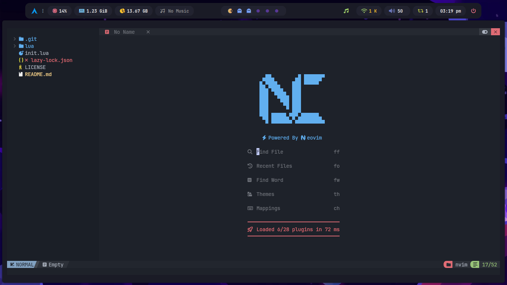

# ✨ My Neovim Setup

<div align="center">


</div>

<div align="center">
  
  <p><em>✨ Dark theme preview ✨</em></p>
</div>

## 🧰 Tech Stack

### 🔧 Core Tools

This setup provides a robust and modular development environment, using modern tools for productivity, organization, and performance.

<div align="center">


</div>

### 🧪 Supported languages

This environment offers full support for multiple languages, with syntax highlighting, autocompletion, linting and formatting.

<div align="center">

| Icon                                                                                                                       | LSP Server                    | Description                              |
| -------------------------------------------------------------------------------------------------------------------------- | ----------------------------- | ---------------------------------------- |
|     | `biome`                       | JavaScript/TypeScript formatter + linter |
|                       | `css-lsp`                     | CSS language intelligence                |
|                             | `gopls`                       | Go language server                       |
|                    | `html-lsp`                    | HTML language support                    |
|                          | `intelephense`                | PHP language server                      |
|                          | `lua-language-server`         | Lua language support                     |
|                 | `prisma-language-server`      | Prisma ORM language support              |
|  | `tailwindcss-language-server` | Tailwind CSS intelligence                |
|     | `ts_ls`                       | TypeScript language support              |
|                       | `yamlls`                      | YAML language support                    |

</div>

## ⌨️ Copilot Shortcuts

<div align="center">

| Shortcut    | Mode   | Action              |
| ----------- | ------ | ------------------- |
| `<M-Tab>`   | Insert | Accept suggestion   |
| `<M-]>`     | Insert | Next suggestion     |
| `<M-[>`     | Insert | Previous suggestion |
| `<C-]>`     | Insert | Dismiss suggestion  |
| `<M-\>`     | Insert | Trigger completion  |
| `<M-Right>` | Insert | Accept next word    |


</div>

## 🚀 Quick Installation

```bash
# Clone the repository into Neovim configuration directory
git clone https://github.com/VictorzllDev/nvim.git ~/.config/nvim

# Start Neovim to automatically install plugins
nvim
```

<p align="center">Brasil 🇧🇷 <a href="https://github.com/VictorzllDev">Victor</a> </p>
